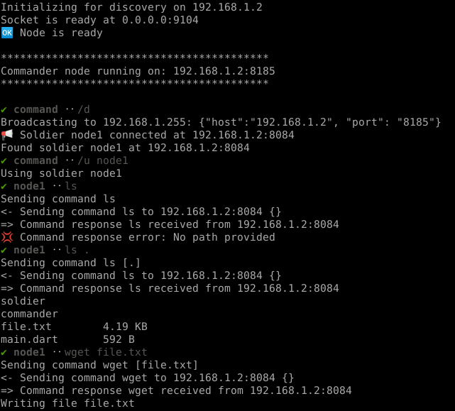
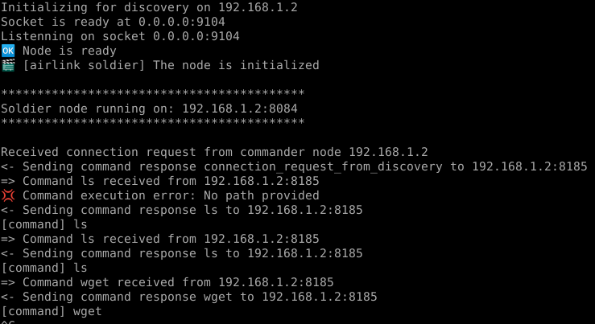

# Airlib

Peer to peer file transfer library for Dart. Powered by [Node commander](https://github.com/synw/nodecommander)

## Initialization

Run a soldier node where to read the files from:

   ```dart
   import 'package:airlib/airlib.dart';

   final ip = await getHost();
   final soldier = AirlinkSoldier.fromIp(ip, name: "node1", verbose: true);
   await soldier.init();
   ```

Run a commander node that will be able to download files:

   ```dart
   final commander = AirlinkCommander.fromIp(ip,
      name: "airlib commander", port: 8088, verbose: true);
   await commander.init();
   ```

## Auto discover soldier nodes

   ```dart
   await commander.node.discoverNodes();
   await Future<dynamic>.delayed(const Duration(seconds: 1));
   if (commander.node.soldiers.isNotEmpty) {
      final soldier = commander.node.soldiers[0];
   }
   ```

## Send commands

**ls**: directory listing

   ```dart
   final cmd = commander.cmd("ls").copyWithArguments(<dynamic>["."]);
   await commander.sendCommand(cmd, soldier.address);
   /// to do something with the result listen to the 
   /// command results stream
   commander.listen((cmd) {
     switch (cmd.name) {
       case "ls":
         final listing = DirectoryListing.fromJson(cmd.payload);
         print(listing.format("-l"));
         break;
       default:
     }
   });
   ```

Note: the `NodeCommand` model is immutable. Commands have to be copied instead of mutated

**wget**: download a file

   ```dart
   await commander.sendCommand(
     commander
         .cmd("wget")
         .copyWithArguments(<dynamic>["/some/path/file.txt"]),
     s.address);
   ```

## Use the cli

Run a soldier node then start the cli: `dart bin/main.dart`



Soldier node:



## Example

To run the example:

- `dart bin main.dart` to start the soldier node
- `dart bin main.dart -c` to start the commander node

